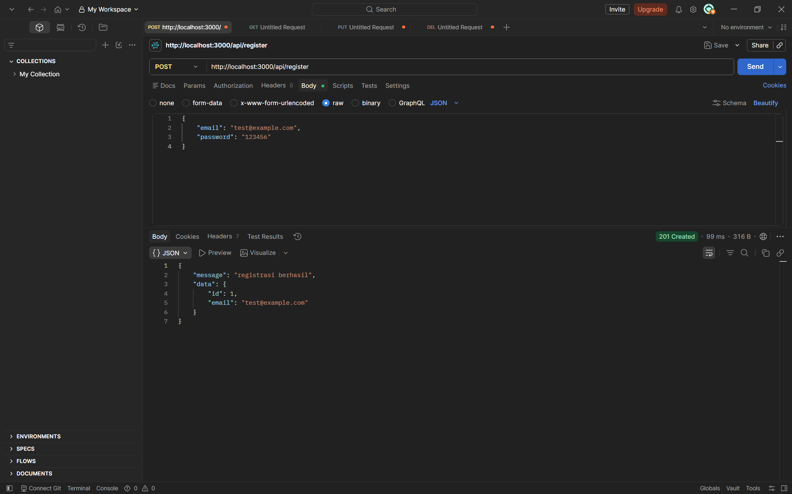
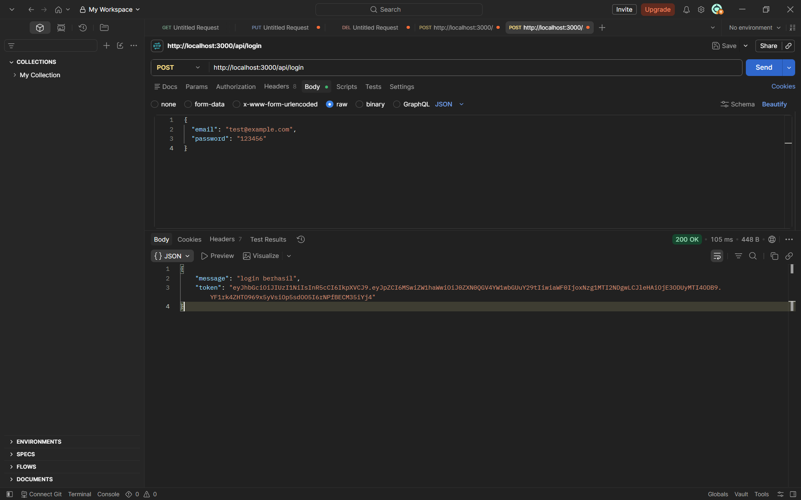
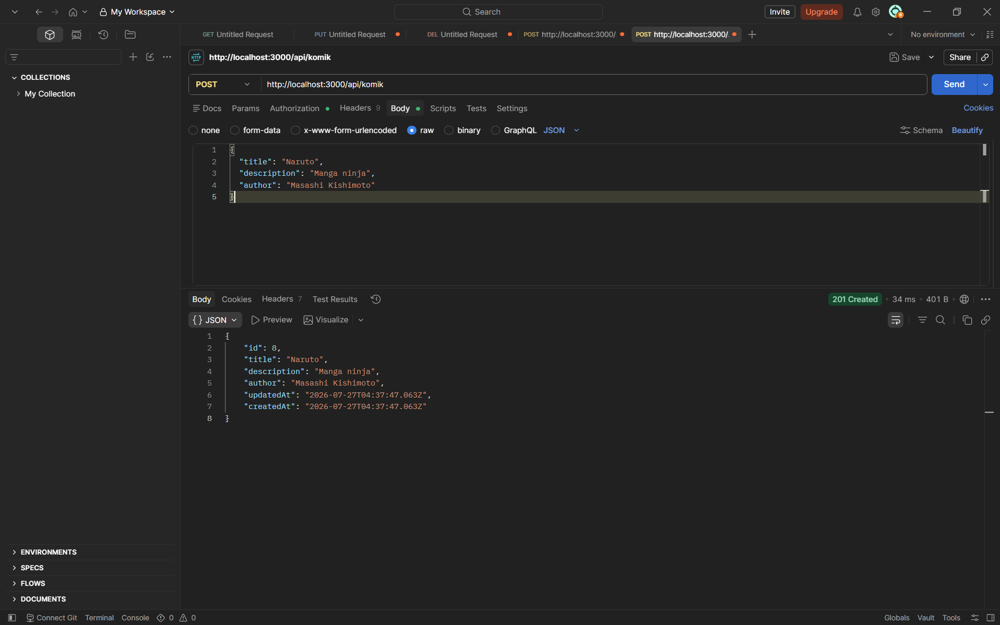
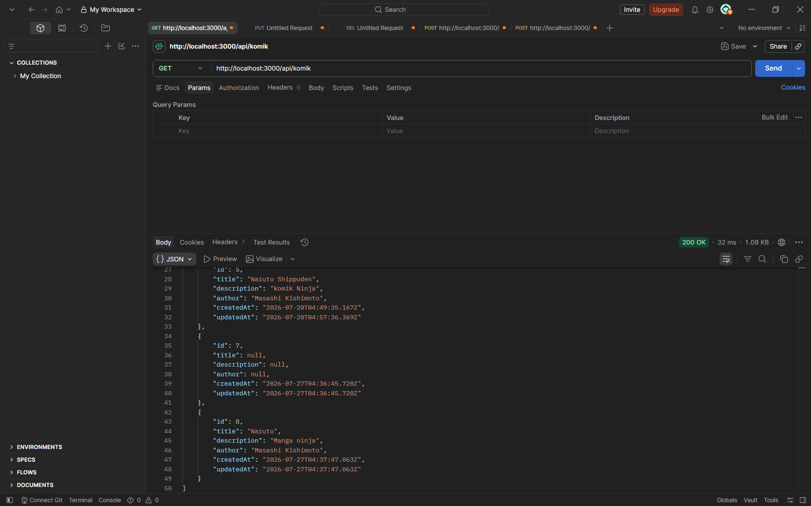
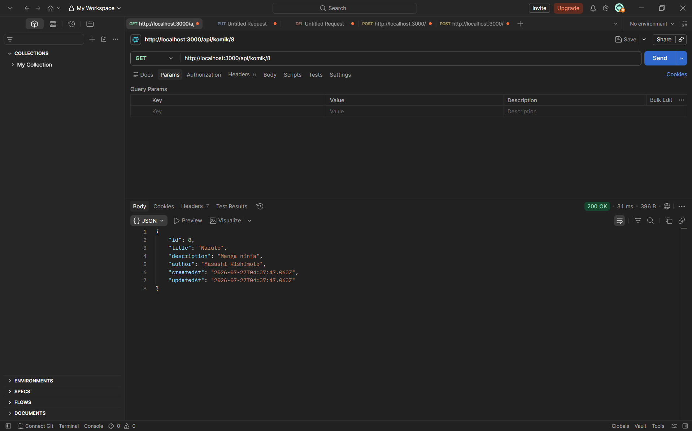
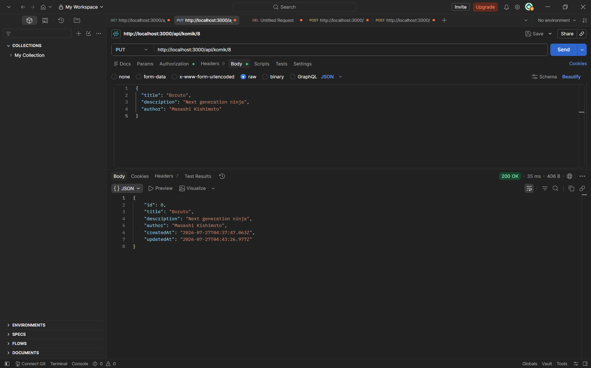
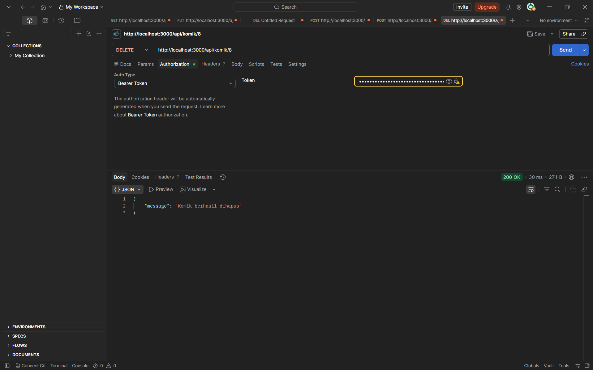

# API Login JWT

## Deskripsi Project

Project ini adalah **REST API** yang dibuat sebagai tugas praktikum mata kuliah **Pengembangan Web Servis** (Pertemuan 7). API ini mensimulasikan sistem backend untuk **manajemen data komik** yang dilengkapi dengan **sistem autentikasi menggunakan JWT (JSON Web Token)**.

Tujuan dari project ini adalah untuk memahami dan mengimplementasikan:
- **Autentikasi pengguna** — registrasi dan login dengan password yang dienkripsi (bcrypt)
- **Token-based authorization** — setiap request POST, PUT, dan DELETE ke endpoint komik harus menyertakan token JWT yang valid
- **CRUD operation** — create, read, update, delete data komik melalui API
- **Integrasi database** — menggunakan PostgreSQL dengan Sequelize ORM

Endpoint GET komik bersifat **public** (bisa diakses tanpa token), sedangkan POST, PUT, dan DELETE komik bersifat **protected** (wajib menyertakan token JWT).

---

## Fitur

- Registrasi pengguna baru
- Login dengan JWT
- CRUD data komik (Create, Read, Update, Delete)
- Enkripsi password dengan bcrypt
- Middleware autentikasi JWT
- Public & protected endpoint

---

## Tech Stack

| Teknologi         | Kegunaan                              |
|-------------------|---------------------------------------|
| Node.js           | Runtime JavaScript                    |
| Express.js        | Framework web                         |
| PostgreSQL        | Database relasional                   |
| Sequelize         | ORM untuk database                    |
| JWT               | Authentication token                  |
| bcrypt            | Enkripsi password                     |
| dotenv            | Mengelola environment variable        |
| nodemon           | Auto-restart saat development         |

---

## Prasyarat

- [Node.js](https://nodejs.org/) (v16+)
- [PostgreSQL](https://www.postgresql.org/)
- npm (termasuk dalam Node.js)

---

## Instalasi & Konfigurasi

### 1. Buat folder project

```bash
mkdir api-login-jwt
cd api-login-jwt
```

### 2. Inisialisasi Node.js

```bash
npm init -y
```

### 3. Install dependencies

```bash
npm i express pg sequelize sequelize-cli dotenv nodemon jsonwebtoken bcrypt
```

| Package           | Fungsi                                       |
|-------------------|----------------------------------------------|
| express           | Framework web Node.js                        |
| pg                | Driver PostgreSQL                            |
| sequelize         | ORM untuk database relasional                |
| sequelize-cli     | CLI tools untuk Sequelize                    |
| dotenv            | Membaca file .env                            |
| nodemon           | Auto-restart server saat development         |
| jsonwebtoken      | Membuat dan memverifikasi JWT                |
| bcrypt            | Hash dan compare password                    |

### 4. Inisialisasi Sequelize

```bash
npx sequelize init
```

Perintah ini membuat folder `config/`, `models/`, `migrations/`, `seeders/` secara otomatis.

### 5. Buat file `.env`

```
DB_USER=postgres
DB_PASS=password_anda
DB_DATABASE=nama_database
DB_HOST=localhost
DB_PORT=5432
DB_DIALECT=postgres
JWT_SECRET=rahasia_jwt_anda
JWT_EXPIRES_IN=1h
```

### 6. Update `config/config.js`

```javascript
require('dotenv').config();

const development = {
    username: process.env.DB_USER,
    password: process.env.DB_PASS,
    database: process.env.DB_DATABASE,
    host: process.env.DB_HOST,
    port: process.env.DB_PORT,
    dialect: process.env.DB_DIALECT
};

module.exports = { development };
```

### 7. Buat database di PostgreSQL

```bash
psql -U postgres -c "CREATE DATABASE nama_database;"
```

### 8. Jalankan aplikasi

```bash
nodemon index.js
```

Server berjalan di `http://localhost:3000`.

---

## Struktur Project

```
api-login-jwt/
├── config/
│   ├── config.js          # Konfigurasi database dari .env
│   └── db.js              # Koneksi database
├── controller/
│   ├── userController.js   # Logic registrasi & login
│   └── komikController.js  # Logic CRUD komik
├── middleware/
│   └── authMiddleware.js   # Middleware verifikasi token JWT
├── migrations/            # Migrasi database
├── models/
│   ├── index.js           # Loader model Sequelize
│   ├── user.js            # Model User
│   └── komik.js           # Model Komik
├── routes/
│   └── api.js             # Routing endpoint
├── seeders/               # Seeder database
├── .env                   # Environment variables
├── .sequelizerc           # Konfigurasi Sequelize CLI
├── index.js               # Entry point aplikasi
├── package.json           # Dependencies
└── README.md              # Dokumentasi
```

---

## Model Database

### User

| Kolom    | Tipe     | Keterangan                    |
|----------|----------|-------------------------------|
| id       | INTEGER  | Primary key, auto increment   |
| email    | STRING   | Email pengguna (unique)       |
| password | STRING   | Password yang sudah di-hash   |

### Komik

| Kolom       | Tipe     | Keterangan          |
|-------------|----------|---------------------|
| id          | INTEGER  | Primary key, auto increment |
| title       | STRING   | Judul komik         |
| description | STRING   | Deskripsi komik     |
| author      | STRING   | Pengarang komik     |

---

## Middleware Autentikasi

File: `middleware/authMiddleware.js`

Middleware ini memverifikasi token JWT yang dikirim melalui header:

```
Authorization: Bearer <token>
```

Alur kerja:
1. Ambil header `Authorization` dari request
2. Ekstrak token setelah kata "Bearer"
3. Verifikasi token menggunakan `JWT_SECRET` dari .env
4. Jika valid -> data user (id, email) disimpan ke `req.user` -> lanjut ke controller
5. Jika tidak valid / kadaluarsa -> return 401

---

## API Endpoints

### Autentikasi (Public)

#### Register

```http
POST http://localhost:3000/api/register
Content-Type: application/json

{
    "email": "user@example.com",
    "password": "password123"
}
```

Response `201`:
```json
{
    "message": "registrasi berhasil",
    "data": { "id": 1, "email": "user@example.com" }
}
```

#### Login

```http
POST http://localhost:3000/api/login
Content-Type: application/json

{
    "email": "user@example.com",
    "password": "password123"
}
```

Response `200`:
```json
{
    "message": "login berhasil",
    "token": "eyJhbGciOiJIUzI1NiIs..."
}
```

### Komik

| Method | Endpoint              | Auth     | Deskripsi            |
|--------|----------------------|----------|----------------------|
| GET    | `/api/komik`          | Public   | Ambil semua komik    |
| GET    | `/api/komik/:id`      | Public   | Ambil komik by ID    |
| POST   | `/api/komik`          | Token    | Tambah komik baru    |
| PUT    | `/api/komik/:id`      | Token    | Update komik         |
| DELETE | `/api/komik/:id`      | Token    | Hapus komik          |

Contoh request protected:
```http
POST http://localhost:3000/api/komik
Content-Type: application/json
Authorization: Bearer <token_dari_login>

{
    "title": "One Piece",
    "description": "Komik petualangan bajak laut",
    "author": "Eiichiro Oda"
}
```

---

## Cara Testing dengan Postman

### 1. Register
```http
POST http://localhost:3000/api/register
Content-Type: application/json

{
    "email": "test@example.com",
    "password": "123456"
}
```

### 2. Login
```http
POST http://localhost:3000/api/login
Content-Type: application/json

{
    "email": "test@example.com",
    "password": "123456"
}
```
> **Ambil token** dari response untuk digunakan di endpoint protected.

### 3. GET Semua Komik (Public)
```http
GET http://localhost:3000/api/komik
```
(Tanpa header Authorization)

### 4. GET Komik by ID (Public)
```http
GET http://localhost:3000/api/komik/1
```

### 5. Tambah Komik (Protected)
```http
POST http://localhost:3000/api/komik
Content-Type: application/json
Authorization: Bearer <token_dari_login>

{
    "title": "Naruto",
    "description": "Manga ninja",
    "author": "Masashi Kishimoto"
}
```

### 6. Update Komik (Protected)
```http
PUT http://localhost:3000/api/komik/1
Content-Type: application/json
Authorization: Bearer <token_dari_login>

{
    "title": "One Piece",
    "description": "Bajak laut",
    "author": "Oda"
}
```

### 7. Hapus Komik (Protected)
```http
DELETE http://localhost:3000/api/komik/1
Authorization: Bearer <token_dari_login>
```

---

## Screenshot Testing Postman

### Register


### Login


### Tambah Komik


### GET Semua Komik


### GET Komik by ID


### Update Komik


### Hapus Komik


---

## Lisensi

ISC
